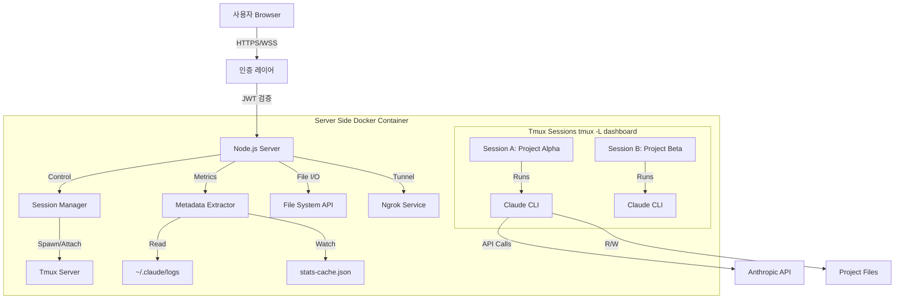
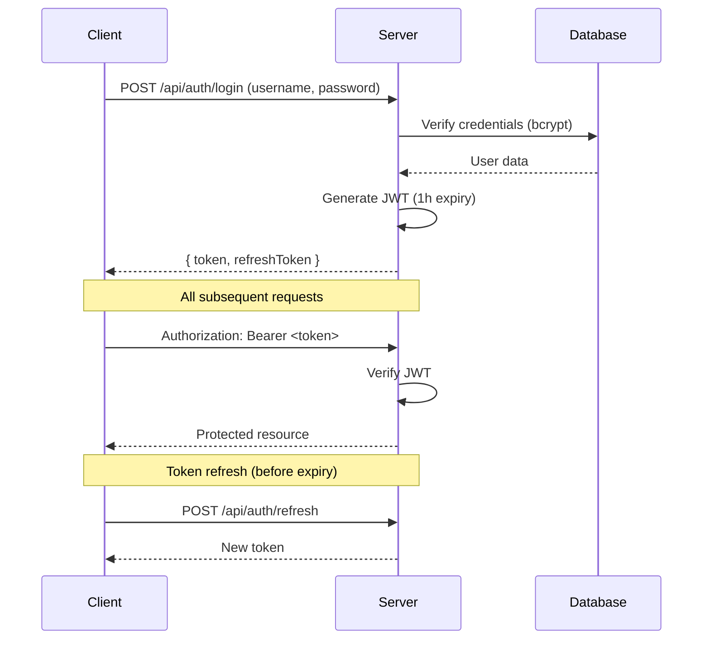

# Claude Code 세션 관리 웹 대시보드 구현 계획서 v2.1

> **버전:** 2.1 (2024-12 버그 수정 및 보안 강화)
> **변경 사항:** Master/Viewer 로직 수정, 경로 검증 완성, spawn 기반 대용량 입력, 메모리 누수 수정, Phase 재조정, CSRF/CSP 추가, 테스트 전략 섹션 추가

---

## 1. 프로젝트 개요 (Project Overview)

### 1.1 목적
본 프로젝트는 터미널 기반의 **Claude Code CLI**를 웹 브라우저에서 시각적으로 관리하고 제어하기 위한 **통합 대시보드 시스템**을 구축하는 것을 목적으로 합니다. 로컬 환경뿐만 아니라 원격(Headless) 서버 환경에서도 안전하게 접속하여, 다수의 프로젝트 세션을 동시에 모니터링하고 제어하며, 파일 시스템 조작까지 가능한 올인원(All-in-One) 인터페이스를 제공합니다.

### 1.2 핵심 기능 요약
1.  **세션 영속성:** 브라우저 종료 후에도 `tmux` 백엔드를 통해 Claude의 작업 상태 유지 및 재연결
2.  **멀티 세션 대시보드:** 여러 프로젝트의 Claude 인스턴스 상태(진행률, 컨텍스트 사용량)를 한눈에 파악
3.  **웹 터미널 및 에디터:** `xterm.js` 기반의 실시간 터미널과 `Monaco Editor` 기반의 파일 편집 기능 통합
4.  **원격 접근성:** ngrok 터널을 통한 외부 접속 (Opt-in, 기본 비활성화)
5.  **파일 시스템 관리:** GUI 기반의 파일 탐색, 생성, 수정, 삭제 기능
6.  **다중 클라이언트 지원:** 마스터/뷰어 모드로 동시 접속 관리

### 1.3 기술 스택
*   **Backend:** Node.js 18+, Express, Socket.io, `node-pty`, `tmux` (OS 레벨)
*   **Frontend:** React 18, Tailwind CSS, `xterm.js` (터미널), `monaco-editor` (코드 편집), Lucide React (아이콘)
*   **Database:** SQLite (better-sqlite3)
*   **Infrastructure:** Docker (권장 배포 방식), ngrok (원격 접속, opt-in)
*   **Security:** JWT 기반 인증, Helmet.js (CSP/HSTS), CSRF 보호 (csurf), rate-limiter-flexible

### 1.4 보안 원칙 (Security First)
*   **기본 localhost 바인딩:** 외부 접근은 명시적 opt-in 필요
*   **Docker 격리:** 프로덕션 환경에서 필수
*   **최소 권한 원칙:** 제한된 사용자 계정으로 실행
*   **입력 검증:** 모든 사용자 입력에 대한 엄격한 검증

---

## 2. 시스템 아키텍처 (System Architecture)

### 2.1 전체 구조도



### 2.2 컴포넌트 설명

| 컴포넌트 | 책임 | 보안 고려사항 |
|---------|------|--------------|
| **AuthLayer** | JWT 토큰 검증, 세션 관리 | HTTPS 필수, 토큰 만료 관리 |
| **SessionManager** | tmux 세션 CRUD, 상태 조회 | 세션 ID UUID 검증, 명령 주입 방지 |
| **MetadataExtractor** | Claude 상태 정보 추출 | 파일 읽기 전용 |
| **FileExplorer** | 파일 시스템 CRUD | Path Traversal 방지, 화이트리스트 |
| **WebSocketHandler** | 실시간 터미널 스트리밍 | 연결 시 JWT 검증, 리스너 정리 |

### 2.3 데이터 흐름

#### 2.3.1 인증 흐름
```
1. 로그인 → POST /api/auth/login (credentials)
2. 서버 → JWT 토큰 발급 (1시간 만료)
3. 클라이언트 → 모든 요청에 Authorization: Bearer <token>
4. WebSocket → connection handshake에서 토큰 검증
```

#### 2.3.2 입력 흐름
```
사용자 입력 → Socket.io (JWT 검증) → Server → SessionManager.sendInput()
→ execFile('tmux', ['send-keys', ...]) → Claude CLI
```

#### 2.3.3 메타데이터 추출 흐름 (우선순위)
```
1순위: claude --print --output-format json (비대화형 쿼리)
2순위: ~/.claude/projects/<id>/sessions.jsonl 파일 감시
3순위: ~/.claude/statsig-cache.json 읽기
4순위: tmux capture-pane (Fallback)
```

---

## 3. 백엔드 설계 (Backend Design)

### 3.1 디렉토리 구조
```text
/server
├── config/
│   ├── default.js        # 기본 설정
│   ├── production.js     # 프로덕션 설정
│   └── security.js       # 보안 관련 상수
├── middleware/
│   ├── auth.js           # JWT 검증 미들웨어
│   ├── rateLimiter.js    # 요청 제한
│   ├── validator.js      # 입력 검증
│   └── errorHandler.js   # 글로벌 에러 핸들러
├── controllers/
│   ├── sessionController.js
│   ├── fileController.js
│   └── authController.js
├── services/
│   ├── SessionManager.js     # tmux 제어 (보안 강화)
│   ├── MetadataExtractor.js  # 상태 정보 추출 (신규)
│   ├── FileExplorer.js       # 파일 시스템 CRUD
│   ├── SocketHandler.js      # 웹소켓 이벤트 처리
│   ├── AuthService.js        # 인증 로직
│   ├── AuditLogger.js        # 감사 로그 (신규)
│   └── NgrokManager.js       # 터널링 제어
├── routes/
│   ├── sessions.js
│   ├── files.js
│   └── auth.js
├── utils/
│   ├── pathValidator.js      # 경로 검증 유틸
│   ├── sessionIdValidator.js # 세션 ID 검증
│   └── parsePatterns.js      # 파싱 패턴 설정 파일
├── db/
│   └── schema.sql
└── app.js
```

### 3.2 핵심 모듈 상세

#### 3.2.1 SessionManager (보안 강화)

**주요 변경사항:**
- `execSync` 완전 제거 → `execFile`/`spawn` 사용
- 세션 ID를 UUID v4로 통일
- 전용 tmux 소켓 사용 (`tmux -L dashboard`)
- 서버 시작 시 기존 세션 복구

```javascript
// server/services/SessionManager.js
const { execFile, spawn } = require('child_process');
const { promisify } = require('util');
const { v4: uuidv4, validate: uuidValidate } = require('uuid');
const EventEmitter = require('events');

const execFileAsync = promisify(execFile);

// 보안: tmux 전용 소켓 이름 (격리)
const TMUX_SOCKET = 'claude-dashboard';

class SessionManager extends EventEmitter {
  constructor(db) {
    super();
    this.db = db;
    this.activeSessions = new Map();
    this.masterClients = new Map(); // 세션별 마스터 클라이언트
  }

  // 서버 시작 시 기존 tmux 세션 복구
  async recoverSessions() {
    try {
      const { stdout } = await execFileAsync('tmux', [
        '-L', TMUX_SOCKET,
        'list-sessions', '-F', '#{session_name}'
      ]);

      const existingSessions = stdout.trim().split('\n').filter(Boolean);

      for (const sessionId of existingSessions) {
        if (uuidValidate(sessionId)) {
          // DB에서 세션 정보 복구 또는 새로 등록
          const dbSession = this.db.prepare(
            'SELECT * FROM sessions WHERE session_id = ?'
          ).get(sessionId);

          if (dbSession) {
            this.activeSessions.set(sessionId, {
              ...dbSession,
              status: 'recovered'
            });
          } else {
            // 고아 세션 - DB에 등록
            this.db.prepare(`
              INSERT INTO sessions (session_id, project_name, status, created_at)
              VALUES (?, ?, ?, datetime('now'))
            `).run(sessionId, 'recovered-session', 'active');

            this.activeSessions.set(sessionId, {
              session_id: sessionId,
              status: 'recovered'
            });
          }
        }
      }

      console.log(`[SessionManager] Recovered ${this.activeSessions.size} sessions`);
    } catch (error) {
      // tmux 서버가 없으면 정상 (첫 실행)
      if (!error.message.includes('no server running')) {
        console.error('[SessionManager] Recovery error:', error);
      }
    }
  }

  // 세션 ID 검증 (Command Injection 방지)
  validateSessionId(id) {
    if (!id || typeof id !== 'string') {
      throw new Error('Invalid session ID: must be a string');
    }
    if (!uuidValidate(id)) {
      throw new Error('Invalid session ID: must be UUID v4 format');
    }
    return true;
  }

  // 새 세션 생성
  async createSession(projectPath, projectName) {
    const sessionId = uuidv4();

    // 프로젝트 경로 검증
    const validatedPath = await this.validateProjectPath(projectPath);

    // tmux 세션 생성 (execFile 사용 - 쉘 해석 없음)
    await execFileAsync('tmux', [
      '-L', TMUX_SOCKET,
      'new-session',
      '-d',                    // detached
      '-s', sessionId,         // 세션 이름
      '-c', validatedPath,     // 작업 디렉토리
      'claude'                 // 실행 명령
    ]);

    // DB 저장
    this.db.prepare(`
      INSERT INTO sessions (session_id, project_name, project_path, status, created_at)
      VALUES (?, ?, ?, 'active', datetime('now'))
    `).run(sessionId, projectName, validatedPath);

    this.activeSessions.set(sessionId, {
      session_id: sessionId,
      project_name: projectName,
      project_path: validatedPath,
      status: 'active'
    });

    // 감사 로그
    this.emit('audit', {
      action: 'session_created',
      sessionId,
      projectPath: validatedPath
    });

    return sessionId;
  }

  // 세션 존재 확인
  async hasSession(sessionId) {
    this.validateSessionId(sessionId);

    try {
      await execFileAsync('tmux', [
        '-L', TMUX_SOCKET,
        'has-session', '-t', sessionId
      ]);
      return true;
    } catch {
      return false;
    }
  }

  // 세션 목록 조회
  async listSessions() {
    try {
      const { stdout } = await execFileAsync('tmux', [
        '-L', TMUX_SOCKET,
        'list-sessions',
        '-F', '#{session_name}:#{session_activity}:#{session_attached}'
      ]);

      return stdout.trim().split('\n')
        .filter(Boolean)
        .map(line => {
          const [id, activity, attached] = line.split(':');
          const dbInfo = this.activeSessions.get(id) || {};
          return {
            session_id: id,
            project_name: dbInfo.project_name || 'Unknown',
            last_activity: new Date(parseInt(activity) * 1000),
            attached_clients: parseInt(attached),
            ...dbInfo
          };
        });
    } catch {
      return [];
    }
  }

  // 입력 전송 (마스터 클라이언트만 가능)
  async sendInput(sessionId, input, clientId) {
    this.validateSessionId(sessionId);

    // 마스터 클라이언트 검증
    const master = this.masterClients.get(sessionId);
    if (master && master !== clientId) {
      throw new Error('Only master client can send input');
    }

    // 입력 데이터 검증 (문자열만 허용)
    if (typeof input !== 'string') {
      throw new Error('Input must be a string');
    }

    // tmux send-keys 사용 (리터럴 모드)
    await execFileAsync('tmux', [
      '-L', TMUX_SOCKET,
      'send-keys', '-t', sessionId,
      '-l',  // 리터럴 모드 (특수문자 이스케이프 불필요)
      input
    ]);
  }

  // [v2.1 수정] 대용량 텍스트 전송 (spawn 사용 - execFile은 input 미지원)
  async sendLargeInput(sessionId, text, clientId) {
    this.validateSessionId(sessionId);

    const master = this.masterClients.get(sessionId);
    if (master && master !== clientId) {
      throw new Error('Only master client can send input');
    }

    // spawn으로 stdin에 텍스트 전달
    await new Promise((resolve, reject) => {
      const proc = spawn('tmux', ['-L', TMUX_SOCKET, 'load-buffer', '-']);

      proc.stdin.write(text);
      proc.stdin.end();

      proc.on('close', (code) => {
        if (code === 0) resolve();
        else reject(new Error(`tmux load-buffer exited with code ${code}`));
      });

      proc.on('error', reject);
    });

    // paste-buffer로 세션에 붙여넣기
    await execFileAsync('tmux', [
      '-L', TMUX_SOCKET,
      'paste-buffer', '-t', sessionId
    ]);
  }

  // 세션 종료
  async killSession(sessionId) {
    this.validateSessionId(sessionId);

    await execFileAsync('tmux', [
      '-L', TMUX_SOCKET,
      'kill-session', '-t', sessionId
    ]);

    this.db.prepare(
      'UPDATE sessions SET status = ?, ended_at = datetime("now") WHERE session_id = ?'
    ).run('terminated', sessionId);

    this.activeSessions.delete(sessionId);
    this.masterClients.delete(sessionId);

    this.emit('audit', { action: 'session_killed', sessionId });
  }

  // 마스터/뷰어 관리
  setMaster(sessionId, clientId) {
    this.validateSessionId(sessionId);
    this.masterClients.set(sessionId, clientId);
  }

  releaseMaster(sessionId, clientId) {
    if (this.masterClients.get(sessionId) === clientId) {
      this.masterClients.delete(sessionId);
    }
  }

  // 특정 클라이언트가 마스터인지 확인
  isMaster(sessionId, clientId) {
    return this.masterClients.get(sessionId) === clientId;
  }

  // [v2.1 추가] 세션에 마스터가 존재하는지 확인
  hasMaster(sessionId) {
    return this.masterClients.has(sessionId);
  }

  // 프로젝트 경로 검증
  async validateProjectPath(inputPath) {
    const path = require('path');
    const fs = require('fs').promises;

    const ALLOWED_ROOTS = (process.env.ALLOWED_PROJECT_ROOTS || '')
      .split(':')
      .filter(Boolean);

    if (ALLOWED_ROOTS.length === 0) {
      throw new Error('ALLOWED_PROJECT_ROOTS not configured');
    }

    // realpath로 심볼릭 링크 해결
    const realPath = await fs.realpath(inputPath);

    // [v2.1 수정] 화이트리스트 검증 - path.sep 추가로 /projects-evil 허용 방지
    const isAllowed = ALLOWED_ROOTS.some(root => {
      const resolvedRoot = path.resolve(root);
      return realPath === resolvedRoot || realPath.startsWith(resolvedRoot + path.sep);
    });

    if (!isAllowed) {
      throw new Error('Path not in allowed roots');
    }

    return realPath;
  }
}

module.exports = SessionManager;
```

#### 3.2.2 MetadataExtractor (신규)

Claude CLI의 상태 정보를 추출하는 새로운 서비스입니다.

```javascript
// server/services/MetadataExtractor.js
const { execFile } = require('child_process');
const { promisify } = require('util');
const fs = require('fs').promises;
const path = require('path');
const chokidar = require('chokidar');
const EventEmitter = require('events');

const execFileAsync = promisify(execFile);

class MetadataExtractor extends EventEmitter {
  constructor() {
    super();
    this.claudeHome = path.join(process.env.HOME, '.claude');
    this.watchers = new Map();
    this.pollingIntervals = new Map();
  }

  /**
   * 우선순위 1: --print --output-format json 사용
   * 비대화형 쿼리로 Claude 상태 조회
   */
  async getStatusViaJSON(projectPath) {
    try {
      const { stdout } = await execFileAsync('claude', [
        '--print',
        '--output-format', 'json',
        '--cwd', projectPath,
        '/status'  // 내장 상태 명령 (가정)
      ], { timeout: 5000 });

      return JSON.parse(stdout);
    } catch (error) {
      // JSON 모드 미지원 시 다음 방법으로
      return null;
    }
  }

  /**
   * 우선순위 2: 프로젝트별 세션 로그 파일 감시
   * ~/.claude/projects/<hash>/sessions.jsonl
   */
  async watchSessionLogs(sessionId, projectPath) {
    const projectHash = this.hashPath(projectPath);
    const logPath = path.join(
      this.claudeHome,
      'projects',
      projectHash,
      'sessions.jsonl'
    );

    try {
      await fs.access(logPath);

      const watcher = chokidar.watch(logPath, {
        persistent: true,
        awaitWriteFinish: { stabilityThreshold: 500 }
      });

      watcher.on('change', async () => {
        const metadata = await this.parseSessionLog(logPath);
        this.emit('metadata', { sessionId, ...metadata });
      });

      this.watchers.set(sessionId, watcher);

      // 초기 데이터 읽기
      return await this.parseSessionLog(logPath);
    } catch {
      return null;
    }
  }

  async parseSessionLog(logPath) {
    try {
      const content = await fs.readFile(logPath, 'utf-8');
      const lines = content.trim().split('\n').filter(Boolean);

      if (lines.length === 0) return null;

      // 마지막 엔트리 파싱
      const lastEntry = JSON.parse(lines[lines.length - 1]);

      return {
        tokenUsage: lastEntry.usage?.total_tokens,
        contextPercent: lastEntry.context?.percent_used,
        lastMessage: lastEntry.message?.content?.substring(0, 100),
        timestamp: lastEntry.timestamp
      };
    } catch {
      return null;
    }
  }

  /**
   * 우선순위 3: statsig-cache.json 읽기
   * 전역 통계 정보
   */
  async getGlobalStats() {
    const statsPath = path.join(this.claudeHome, 'statsig-cache.json');

    try {
      const content = await fs.readFile(statsPath, 'utf-8');
      return JSON.parse(content);
    } catch {
      return null;
    }
  }

  /**
   * 우선순위 4: tmux capture-pane (Fallback)
   * TUI 화면 스크래핑
   */
  async capturePane(sessionId, tmuxSocket = 'claude-dashboard') {
    try {
      const { stdout } = await execFileAsync('tmux', [
        '-L', tmuxSocket,
        'capture-pane', '-t', sessionId, '-p'
      ]);

      return this.parseTuiOutput(stdout);
    } catch {
      return null;
    }
  }

  /**
   * TUI 출력 파싱 (설정 파일 기반 패턴)
   * [v2.1 수정] getPatterns() 호출 추가
   */
  parseTuiOutput(output) {
    const parsePatterns = require('../utils/parsePatterns');
    const patterns = parsePatterns.getPatterns(); // getPatterns() 호출 필수

    const result = {};

    for (const [key, pattern] of Object.entries(patterns)) {
      const match = output.match(new RegExp(pattern));
      if (match) {
        result[key] = match[1];
      }
    }

    return Object.keys(result).length > 0 ? result : null;
  }

  /**
   * 통합 메타데이터 조회 (우선순위 순)
   * [v2.1 수정] watcher 중복 생성 방지로 메모리 누수 해결
   */
  async getMetadata(sessionId, projectPath) {
    // 1. JSON API 시도
    let metadata = await this.getStatusViaJSON(projectPath);
    if (metadata) return { source: 'json-api', ...metadata };

    // 2. 로그 파일 시도 - watcher가 이미 존재하면 재사용
    if (!this.watchers.has(sessionId)) {
      metadata = await this.watchSessionLogs(sessionId, projectPath);
    } else {
      // 기존 watcher 있으면 로그만 다시 파싱
      const projectHash = this.hashPath(projectPath);
      const logPath = path.join(this.claudeHome, 'projects', projectHash, 'sessions.jsonl');
      metadata = await this.parseSessionLog(logPath);
    }
    if (metadata) return { source: 'log-file', ...metadata };

    // 3. 전역 통계
    const stats = await this.getGlobalStats();

    // 4. TUI 스크래핑
    const tuiData = await this.capturePane(sessionId);

    return {
      source: 'fallback',
      globalStats: stats,
      tuiData
    };
  }

  /**
   * 적응형 폴링 (세션 상태에 따라 주기 조절)
   */
  startPolling(sessionId, projectPath, isActive = true) {
    const interval = isActive ? 1000 : 10000; // 활성 1초, 비활성 10초

    const pollFn = async () => {
      const metadata = await this.getMetadata(sessionId, projectPath);
      this.emit('metadata', { sessionId, ...metadata });
    };

    const timerId = setInterval(pollFn, interval);
    this.pollingIntervals.set(sessionId, { timerId, interval });

    pollFn(); // 즉시 첫 실행
  }

  updatePollingRate(sessionId, isActive) {
    const current = this.pollingIntervals.get(sessionId);
    if (!current) return;

    const newInterval = isActive ? 1000 : 10000;
    if (current.interval === newInterval) return;

    clearInterval(current.timerId);
    // 새 주기로 재시작 (구현 생략)
  }

  stopPolling(sessionId) {
    const polling = this.pollingIntervals.get(sessionId);
    if (polling) {
      clearInterval(polling.timerId);
      this.pollingIntervals.delete(sessionId);
    }

    const watcher = this.watchers.get(sessionId);
    if (watcher) {
      watcher.close();
      this.watchers.delete(sessionId);
    }
  }

  hashPath(p) {
    const crypto = require('crypto');
    return crypto.createHash('sha256').update(p).digest('hex').substring(0, 16);
  }
}

module.exports = MetadataExtractor;
```

#### 3.2.3 FileExplorer (보안 강화)

```javascript
// server/services/FileExplorer.js
const fs = require('fs').promises;
const path = require('path');

class FileExplorer {
  constructor() {
    this.allowedRoots = (process.env.ALLOWED_FILE_ROOTS || '')
      .split(':')
      .filter(Boolean)
      .map(p => path.resolve(p));

    if (this.allowedRoots.length === 0) {
      throw new Error('ALLOWED_FILE_ROOTS environment variable is required');
    }
  }

  /**
   * 경로 검증 (Path Traversal 방지)
   */
  async validatePath(userPath) {
    // 1. 절대 경로로 정규화
    const normalized = path.resolve(userPath);

    // [v2.1 추가] basename 검증 - '..' 또는 '.' 파일명 차단
    const basename = path.basename(normalized);
    if (basename === '..' || basename === '.') {
      throw new Error('Invalid filename: cannot use . or .. as filename');
    }

    // 2. realpath로 심볼릭 링크 해결
    let realPath;
    try {
      realPath = await fs.realpath(normalized);
    } catch (error) {
      // 파일이 존재하지 않는 경우 (새 파일 생성 시)
      // 부모 디렉토리 검증
      const parentPath = path.dirname(normalized);
      realPath = await fs.realpath(parentPath);
      realPath = path.join(realPath, path.basename(normalized));
    }

    // 3. 화이트리스트 검증
    const isAllowed = this.allowedRoots.some(root =>
      realPath === root || realPath.startsWith(root + path.sep)
    );

    if (!isAllowed) {
      throw new Error(`Access denied: ${userPath} is outside allowed directories`);
    }

    return realPath;
  }

  /**
   * 디렉토리 목록 조회
   * [v2.1 수정] 상대 경로 반환으로 내부 경로 노출 방지
   */
  async listDirectory(dirPath, baseRoot = null) {
    const validPath = await this.validatePath(dirPath);

    const entries = await fs.readdir(validPath, { withFileTypes: true });

    // baseRoot가 제공되면 상대 경로로 반환 (경로 정보 노출 방지)
    const effectiveRoot = baseRoot || this.allowedRoots[0];

    return entries.map(entry => ({
      name: entry.name,
      // 상대 경로로 반환하여 서버 내부 경로 노출 방지
      relativePath: path.relative(effectiveRoot, path.join(validPath, entry.name)),
      type: entry.isDirectory() ? 'directory' : 'file',
      isSymlink: entry.isSymbolicLink()
    }));
  }

  /**
   * 파일 내용 읽기
   */
  async readFile(filePath) {
    const validPath = await this.validatePath(filePath);

    const stat = await fs.stat(validPath);

    // 파일 크기 제한 (10MB)
    if (stat.size > 10 * 1024 * 1024) {
      throw new Error('File too large (max 10MB)');
    }

    return await fs.readFile(validPath, 'utf-8');
  }

  /**
   * 파일 저장
   */
  async writeFile(filePath, content) {
    const validPath = await this.validatePath(filePath);

    // 내용 크기 제한 (10MB)
    if (Buffer.byteLength(content, 'utf-8') > 10 * 1024 * 1024) {
      throw new Error('Content too large (max 10MB)');
    }

    await fs.writeFile(validPath, content, 'utf-8');
    return validPath;
  }

  /**
   * 파일/폴더 삭제
   */
  async delete(targetPath) {
    const validPath = await this.validatePath(targetPath);

    const stat = await fs.stat(validPath);

    if (stat.isDirectory()) {
      await fs.rm(validPath, { recursive: true });
    } else {
      await fs.unlink(validPath);
    }
  }
}

module.exports = FileExplorer;
```

### 3.3 WebSocket 핸들러 (보안 강화)

```javascript
// server/services/SocketHandler.js
const pty = require('node-pty');
const jwt = require('jsonwebtoken');

const TMUX_SOCKET = 'claude-dashboard';

module.exports = (io, sessionManager, auditLogger) => {
  // WebSocket 연결 시 JWT 검증
  io.use((socket, next) => {
    const token = socket.handshake.auth.token;

    if (!token) {
      return next(new Error('Authentication required'));
    }

    try {
      const decoded = jwt.verify(token, process.env.JWT_SECRET);
      socket.user = decoded;
      next();
    } catch (error) {
      next(new Error('Invalid token'));
    }
  });

  io.on('connection', (socket) => {
    let term = null;
    let currentSessionId = null;
    let isReadOnly = false;

    // 리스너 정리 함수
    const cleanupListeners = () => {
      socket.removeAllListeners('input');
      socket.removeAllListeners('resize');
    };

    socket.on('attach', async ({ sessionId, mode = 'master' }) => {
      try {
        // 세션 ID 검증
        sessionManager.validateSessionId(sessionId);

        // 세션 존재 확인
        if (!(await sessionManager.hasSession(sessionId))) {
          socket.emit('error', { message: 'Session not found' });
          return;
        }

        // 기존 연결 정리
        if (term) {
          cleanupListeners();
          term.kill();
        }

        currentSessionId = sessionId;
        isReadOnly = mode === 'viewer';

        // [v2.1 수정] 마스터/뷰어 모드 처리 - hasMaster() 사용
        if (mode === 'master') {
          if (sessionManager.hasMaster(sessionId)) {
            // 기존 마스터가 있으면 뷰어로 전환
            isReadOnly = true;
            socket.emit('mode-changed', { mode: 'viewer', reason: 'Master already connected' });
          } else {
            sessionManager.setMaster(sessionId, socket.id);
          }
        }

        // tmux attach (뷰어는 읽기 전용)
        const attachArgs = ['-L', TMUX_SOCKET, 'attach-session', '-t', sessionId];
        if (isReadOnly) {
          attachArgs.push('-r'); // 읽기 전용 모드
        }

        term = pty.spawn('tmux', attachArgs, {
          name: 'xterm-256color',
          cols: 80,
          rows: 30,
          cwd: process.env.HOME,
        });

        term.onData((data) => socket.emit('output', data));

        term.onExit(({ exitCode }) => {
          socket.emit('session-ended', { exitCode });
          currentSessionId = null;
        });

        // 입력 리스너 (마스터만)
        socket.on('input', (data) => {
          if (!isReadOnly && term) {
            term.write(data);
          }
        });

        // 리사이즈 리스너
        socket.on('resize', (size) => {
          if (term && size.cols > 0 && size.rows > 0) {
            term.resize(size.cols, size.rows);
          }
        });

        // 감사 로그
        auditLogger.log({
          action: 'session_attached',
          sessionId,
          userId: socket.user.id,
          mode: isReadOnly ? 'viewer' : 'master'
        });

        socket.emit('attached', {
          sessionId,
          mode: isReadOnly ? 'viewer' : 'master'
        });

      } catch (error) {
        socket.emit('error', { message: error.message });
      }
    });

    // [v2.1 수정] 마스터 권한 요청 - hasMaster() 사용
    socket.on('request-master', () => {
      if (!currentSessionId || !isReadOnly) return;

      if (!sessionManager.hasMaster(currentSessionId)) {
        sessionManager.setMaster(currentSessionId, socket.id);
        isReadOnly = false;
        socket.emit('mode-changed', { mode: 'master' });
      } else {
        socket.emit('mode-changed', {
          mode: 'viewer',
          reason: 'Master still connected'
        });
      }
    });

    socket.on('disconnect', () => {
      cleanupListeners();

      if (currentSessionId) {
        sessionManager.releaseMaster(currentSessionId, socket.id);
      }

      if (term) {
        term.kill();
        term = null;
      }
    });
  });
};
```

### 3.4 API 엔드포인트 설계

| Method | Endpoint | 설명 | 인증 | Rate Limit |
|--------|----------|------|------|------------|
| POST | `/api/auth/login` | 로그인 | No | 5/min |
| POST | `/api/auth/refresh` | 토큰 갱신 | Yes | 10/min |
| GET | `/api/sessions` | 세션 목록 | Yes | 60/min |
| POST | `/api/sessions` | 새 세션 생성 | Yes | 10/min |
| DELETE | `/api/sessions/:id` | 세션 종료 | Yes | 10/min |
| GET | `/api/sessions/:id/metadata` | 세션 메타데이터 | Yes | 120/min |
| GET | `/api/sessions/:id/share` | 관전 링크 생성 | Yes | 10/min |
| GET | `/api/files` | 파일/폴더 목록 | Yes | 120/min |
| GET | `/api/files/content` | 파일 내용 | Yes | 60/min |
| POST | `/api/files/save` | 파일 저장 | Yes | 30/min |
| DELETE | `/api/files` | 파일 삭제 | Yes | 10/min |
| POST | `/api/tunnel/start` | ngrok 시작 | Yes | 1/hour |
| DELETE | `/api/tunnel/stop` | ngrok 중지 | Yes | 5/min |
| GET | `/health` | 헬스체크 | No | - |
| GET | `/api/audit` | 감사 로그 조회 | Yes (Admin) | 10/min |

### 3.5 데이터베이스 스키마 (SQLite)

```sql
-- server/db/schema.sql

-- [v2.1 추가] WAL 모드 활성화 (동시 읽기/쓰기 성능 향상)
PRAGMA journal_mode = WAL;
PRAGMA synchronous = NORMAL;
PRAGMA foreign_keys = ON;

-- 세션 정보
CREATE TABLE IF NOT EXISTS sessions (
    session_id TEXT PRIMARY KEY,
    project_name TEXT NOT NULL,
    project_path TEXT,
    status TEXT DEFAULT 'active' CHECK(status IN ('active', 'idle', 'terminated')),
    created_at DATETIME DEFAULT CURRENT_TIMESTAMP,
    ended_at DATETIME,
    last_active DATETIME
);

-- 메타데이터 로그
CREATE TABLE IF NOT EXISTS metadata_logs (
    id INTEGER PRIMARY KEY AUTOINCREMENT,
    session_id TEXT NOT NULL,
    token_usage INTEGER,
    context_percent INTEGER,
    cost_usd REAL,
    source TEXT, -- 'json-api', 'log-file', 'fallback'
    timestamp DATETIME DEFAULT CURRENT_TIMESTAMP,
    FOREIGN KEY (session_id) REFERENCES sessions(session_id)
);

CREATE INDEX idx_metadata_session ON metadata_logs(session_id);
CREATE INDEX idx_metadata_timestamp ON metadata_logs(timestamp);

-- 감사 로그
CREATE TABLE IF NOT EXISTS audit_logs (
    id INTEGER PRIMARY KEY AUTOINCREMENT,
    user_id TEXT,
    action TEXT NOT NULL,
    resource_type TEXT, -- 'session', 'file', 'tunnel'
    resource_id TEXT,
    details TEXT, -- JSON
    ip_address TEXT,
    timestamp DATETIME DEFAULT CURRENT_TIMESTAMP
);

CREATE INDEX idx_audit_user ON audit_logs(user_id);
CREATE INDEX idx_audit_timestamp ON audit_logs(timestamp);

-- 사용자 (간단한 인증용)
CREATE TABLE IF NOT EXISTS users (
    id TEXT PRIMARY KEY,
    username TEXT UNIQUE NOT NULL,
    password_hash TEXT NOT NULL,
    role TEXT DEFAULT 'user' CHECK(role IN ('admin', 'user')),
    created_at DATETIME DEFAULT CURRENT_TIMESTAMP
);
```

---

## 4. 프론트엔드 설계 (Frontend Design)

### 4.1 디렉토리 구조
```text
/client
├── src/
│   ├── components/
│   │   ├── auth/
│   │   │   └── LoginForm.tsx
│   │   ├── dashboard/
│   │   │   ├── SessionCard.tsx
│   │   │   ├── SessionList.tsx
│   │   │   └── MetadataDisplay.tsx
│   │   ├── terminal/
│   │   │   ├── XtermWrapper.tsx
│   │   │   └── TerminalControls.tsx
│   │   ├── editor/
│   │   │   └── MonacoEditorWrapper.tsx
│   │   ├── file-tree/
│   │   │   └── FileExplorerComponent.tsx
│   │   └── common/
│   │       ├── LoadingSpinner.tsx
│   │       └── ErrorBoundary.tsx
│   ├── pages/
│   │   ├── Login.tsx
│   │   ├── Dashboard.tsx
│   │   └── SessionView.tsx
│   ├── hooks/
│   │   ├── useAuth.ts
│   │   ├── useSocket.ts
│   │   ├── useSession.ts
│   │   └── useFileSystem.ts
│   ├── services/
│   │   ├── api.ts
│   │   └── socket.ts
│   ├── store/
│   │   ├── authStore.ts
│   │   ├── sessionStore.ts
│   │   └── uiStore.ts
│   └── utils/
│       └── tokenStorage.ts
```

### 4.2 핵심 컴포넌트

#### 4.2.1 SessionCard (상태 표시)
```tsx
// 세션 상태를 시각적으로 표시
interface SessionCardProps {
  session: {
    session_id: string;
    project_name: string;
    status: 'active' | 'idle' | 'terminated';
    metadata?: {
      contextPercent: number;
      tokenUsage: number;
      source: string;
    };
    attachedClients: number;
  };
}

// Context 사용량에 따른 색상
// 0-50%: green, 50-75%: yellow, 75-90%: orange, 90%+: red (critical)
```

#### 4.2.2 TerminalControls (마스터/뷰어 모드)
```tsx
// 연결 모드 표시 및 제어
interface TerminalControlsProps {
  mode: 'master' | 'viewer';
  onRequestMaster: () => void;
  onCreateShareLink: () => void;
}

// 뷰어 모드일 때 "마스터 요청" 버튼 표시
// 관전 링크 생성 버튼
```

### 4.3 상태 관리 (Zustand)

```typescript
// store/sessionStore.ts
interface SessionState {
  sessions: Session[];
  currentSessionId: string | null;
  connectionMode: 'master' | 'viewer' | null;

  // Actions
  fetchSessions: () => Promise<void>;
  createSession: (projectPath: string) => Promise<string>;
  attachSession: (id: string, mode: 'master' | 'viewer') => void;
  updateMetadata: (id: string, metadata: Metadata) => void;
}
```

---

## 5. Claude Code CLI 통합 (Integration Strategy)

### 5.1 메타데이터 추출 전략 (우선순위)

| 우선순위 | 방법 | 장점 | 단점 |
|---------|------|------|------|
| 1 | `--print --output-format json` | 정확, 공식 지원 | 비대화형 쿼리 한정 |
| 2 | `~/.claude/projects/*/sessions.jsonl` | 실시간, 상세 | 파일 위치 변경 가능 |
| 3 | `~/.claude/statsig-cache.json` | 전역 통계 | 세션별 구분 어려움 |
| 4 | `tmux capture-pane` | 어디서나 동작 | 불안정, 파싱 취약 |

### 5.2 실제 Claude 파일 경로 (수정됨)

```
~/.claude/                          # 기본 디렉토리 (NOT ~/.claude_cli)
├── credentials.json               # OAuth 토큰
├── settings.json                  # 사용자 설정
├── statsig-cache.json            # 통계 캐시
└── projects/
    └── <project-hash>/
        ├── sessions.jsonl        # 세션 로그
        └── settings.local.json   # 프로젝트별 설정
```

### 5.3 세션 생성 흐름 (개선)

```
1. POST /api/sessions { projectPath: "/path/to/project" }
2. 서버: 경로 검증 (validateProjectPath)
3. 서버: UUID v4 세션 ID 생성
4. 서버: execFile('tmux', ['-L', 'claude-dashboard', 'new-session', ...])
5. 서버: DB 저장 + 응답
6. 클라이언트: WebSocket 연결 + attach
7. 서버: MetadataExtractor.startPolling(sessionId)
```

### 5.4 다중 클라이언트 시나리오

```
시나리오 1: 첫 번째 사용자 접속
  → 자동으로 master 모드

시나리오 2: 두 번째 사용자 접속
  → 자동으로 viewer 모드 (tmux attach -r)
  → "마스터 요청" 버튼 표시

시나리오 3: 마스터 연결 해제
  → 첫 번째 뷰어가 "마스터 요청" 가능

시나리오 4: 관전 링크 공유
  → 토큰 기반 읽기 전용 접근
  → 1시간 후 자동 만료
```

---

## 6. 보안 (Security) - 대폭 강화

### 6.1 인증 아키텍처



### 6.2 입력 검증 (Command Injection 방지)

```javascript
// server/utils/sessionIdValidator.js
const { validate: uuidValidate } = require('uuid');

function validateSessionId(id) {
  if (typeof id !== 'string') {
    throw new ValidationError('Session ID must be a string');
  }

  if (!uuidValidate(id)) {
    throw new ValidationError('Session ID must be UUID v4 format');
  }

  return true;
}

// 사용 예 - execFile은 쉘 해석을 하지 않음
// 따라서 "; rm -rf /" 같은 주입이 불가능
await execFile('tmux', ['-L', SOCKET, 'has-session', '-t', sessionId]);
// sessionId가 "test; rm -rf /"여도 그대로 tmux 인자로 전달됨
```

### 6.3 Path Traversal 방지

```javascript
// server/utils/pathValidator.js
const path = require('path');
const fs = require('fs').promises;

async function validatePath(userPath, allowedRoots) {
  // Step 1: Normalize (resolve .., .)
  const normalized = path.resolve(userPath);

  // Step 2: Resolve symlinks
  const realPath = await fs.realpath(normalized);

  // Step 3: Check against whitelist
  const isAllowed = allowedRoots.some(root => {
    const resolvedRoot = path.resolve(root);
    return realPath === resolvedRoot ||
           realPath.startsWith(resolvedRoot + path.sep);
  });

  if (!isAllowed) {
    throw new SecurityError(`Path traversal attempt: ${userPath}`);
  }

  return realPath;
}

// 테스트 케이스
// validatePath('../../../etc/passwd', ['/home/user/projects'])
// → SecurityError: Path traversal attempt
```

### 6.4 WebSocket 보안

```javascript
// 연결 시 JWT 검증 (handshake)
io.use((socket, next) => {
  const token = socket.handshake.auth.token;

  if (!token) {
    return next(new Error('Authentication required'));
  }

  try {
    const decoded = jwt.verify(token, process.env.JWT_SECRET);
    socket.user = decoded;

    // IP 기반 추가 검증 (선택)
    if (decoded.allowedIp && socket.handshake.address !== decoded.allowedIp) {
      return next(new Error('IP mismatch'));
    }

    next();
  } catch (error) {
    next(new Error('Invalid or expired token'));
  }
});
```

### 6.5 Rate Limiting

```javascript
// server/middleware/rateLimiter.js
const { RateLimiterMemory } = require('rate-limiter-flexible');

const rateLimiters = {
  login: new RateLimiterMemory({
    points: 5,      // 5회
    duration: 60,   // 1분당
    blockDuration: 300  // 초과 시 5분 블록
  }),

  api: new RateLimiterMemory({
    points: 60,
    duration: 60
  }),

  fileWrite: new RateLimiterMemory({
    points: 30,
    duration: 60
  })
};

const rateLimitMiddleware = (limiterName) => async (req, res, next) => {
  try {
    await rateLimiters[limiterName].consume(req.ip);
    next();
  } catch (error) {
    res.status(429).json({
      error: 'Too many requests',
      retryAfter: error.msBeforeNext / 1000
    });
  }
};
```

### 6.6 CSRF 보호 [v2.1 추가]

```javascript
// server/middleware/csrf.js
const csurf = require('csurf');

// CSRF 보호 미들웨어
const csrfProtection = csurf({
  cookie: {
    httpOnly: true,
    secure: process.env.NODE_ENV === 'production',
    sameSite: 'strict'
  }
});

// CSRF 토큰 제공 엔드포인트
router.get('/api/csrf-token', csrfProtection, (req, res) => {
  res.json({ csrfToken: req.csrfToken() });
});

// POST/PUT/DELETE 엔드포인트에 적용
router.post('/api/sessions', csrfProtection, sessionController.create);
router.delete('/api/sessions/:id', csrfProtection, sessionController.delete);
router.post('/api/files/save', csrfProtection, fileController.save);
router.delete('/api/files', csrfProtection, fileController.delete);
```

### 6.7 Helmet.js 상세 설정 [v2.1 추가]

```javascript
// server/middleware/security.js
const helmet = require('helmet');

const helmetConfig = helmet({
  contentSecurityPolicy: {
    directives: {
      defaultSrc: ["'self'"],
      scriptSrc: ["'self'"],
      styleSrc: ["'self'", "'unsafe-inline'"],  // Tailwind CSS 필요
      imgSrc: ["'self'", "data:", "blob:"],
      connectSrc: ["'self'", "wss:", "ws:"],    // WebSocket 허용
      fontSrc: ["'self'"],
      objectSrc: ["'none'"],
      mediaSrc: ["'none'"],
      frameSrc: ["'none'"],
      upgradeInsecureRequests: process.env.NODE_ENV === 'production' ? [] : null
    }
  },
  hsts: {
    maxAge: 31536000,           // 1년
    includeSubDomains: true,
    preload: true
  },
  referrerPolicy: { policy: 'strict-origin-when-cross-origin' },
  noSniff: true,
  xssFilter: true,
  hidePoweredBy: true
});

module.exports = helmetConfig;
```

### 6.8 JWT 토큰 갱신 및 WebSocket 재연결 [v2.1 추가]

```javascript
// server/services/TokenRefresh.js
class TokenRefreshService {
  constructor(io) {
    this.io = io;
  }

  // 토큰 만료 10분 전 알림
  scheduleRefreshReminder(socket, tokenExp) {
    const reminderTime = (tokenExp * 1000) - Date.now() - (10 * 60 * 1000);

    if (reminderTime > 0) {
      setTimeout(() => {
        socket.emit('token-expiring', {
          expiresIn: 10 * 60,
          message: 'Token expires in 10 minutes. Please refresh.'
        });
      }, reminderTime);
    }
  }

  // 토큰 만료 시 강제 연결 해제
  scheduleDisconnect(socket, tokenExp) {
    const disconnectTime = (tokenExp * 1000) - Date.now();

    if (disconnectTime > 0) {
      setTimeout(() => {
        socket.emit('token-expired', { message: 'Session expired' });
        socket.disconnect(true);
      }, disconnectTime);
    }
  }
}

// 클라이언트 측 자동 갱신
// client/src/hooks/useTokenRefresh.ts
const useTokenRefresh = () => {
  useEffect(() => {
    socket.on('token-expiring', async () => {
      const newToken = await api.post('/api/auth/refresh');
      socket.auth = { token: newToken };
      socket.disconnect().connect(); // 새 토큰으로 재연결
    });
  }, []);
};
```

### 6.9 Docker 격리 (필수 배포 형태)

```dockerfile
# Dockerfile.production
FROM node:18-slim

# 비특권 사용자 생성
RUN groupadd -r claude && useradd -r -g claude claude

# [v2.1 추가] 필수 패키지 + node-pty 빌드 의존성
RUN apt-get update && apt-get install -y --no-install-recommends \
    tmux \
    git \
    python3 \
    make \
    g++ \
    && rm -rf /var/lib/apt/lists/*

# [v2.1 추가] Claude CLI 설치
# 방법 1: npm 글로벌 설치 (권장)
RUN npm install -g @anthropic-ai/claude-code

# 방법 2: 바이너리 복사 (대안)
# COPY --from=claude-cli /usr/local/bin/claude /usr/local/bin/claude

# 앱 디렉토리
WORKDIR /app

# 의존성 설치 (root로, node-pty 네이티브 빌드 포함)
COPY package*.json ./
RUN npm ci --only=production

# 앱 코드 복사
COPY --chown=claude:claude . .

# 비특권 사용자로 전환
USER claude

# 환경 변수
ENV NODE_ENV=production
ENV HOST=127.0.0.1

EXPOSE 3000

CMD ["node", "server/app.js"]
```

```yaml
# docker-compose.yml
version: '3.8'
services:
  dashboard:
    build:
      context: .
      dockerfile: Dockerfile.production
    environment:
      - JWT_SECRET=${JWT_SECRET}
      - ALLOWED_FILE_ROOTS=/projects
      - ALLOWED_PROJECT_ROOTS=/projects
    volumes:
      # 프로젝트 디렉토리만 마운트
      - ${PROJECT_DIR}:/projects:rw
      # Claude 설정 (읽기 전용)
      - ${HOME}/.claude:/home/claude/.claude:ro
      # SQLite DB 영속성
      - dashboard_data:/app/data
    ports:
      # localhost만 바인딩
      - "127.0.0.1:3000:3000"
    security_opt:
      - no-new-privileges:true
    read_only: true
    tmpfs:
      - /tmp
    # [v2.1 추가] 최소 권한 원칙
    cap_drop:
      - ALL
    cap_add:
      - CHOWN
      - SETGID
      - SETUID

volumes:
  dashboard_data:
```

### 6.10 ngrok 보안 (Opt-in)

```javascript
// server/services/NgrokManager.js
const ngrok = require('ngrok');

class NgrokManager {
  constructor() {
    this.url = null;
  }

  async start(options = {}) {
    // 명시적 opt-in 필요
    if (!process.env.ENABLE_NGROK) {
      throw new Error('ngrok is disabled. Set ENABLE_NGROK=true to enable.');
    }

    this.url = await ngrok.connect({
      addr: 3000,
      authtoken: process.env.NGROK_AUTHTOKEN,
      // 기본 인증 활성화 (필수)
      auth: `${process.env.NGROK_USER}:${process.env.NGROK_PASS}`,
      // 지역 설정
      region: process.env.NGROK_REGION || 'us'
    });

    console.log(`[ngrok] Tunnel created: ${this.url}`);
    return this.url;
  }

  async stop() {
    await ngrok.disconnect();
    await ngrok.kill();
    this.url = null;
  }
}
```

### 6.11 감사 로그 (Audit Log)

```javascript
// server/services/AuditLogger.js
class AuditLogger {
  constructor(db) {
    this.db = db;
    this.stmt = db.prepare(`
      INSERT INTO audit_logs (user_id, action, resource_type, resource_id, details, ip_address)
      VALUES (?, ?, ?, ?, ?, ?)
    `);
  }

  log({ userId, action, resourceType, resourceId, details, ipAddress }) {
    this.stmt.run(
      userId,
      action,
      resourceType,
      resourceId,
      JSON.stringify(details),
      ipAddress
    );
  }

  // 최근 로그 조회 (관리자 전용)
  getRecentLogs(limit = 100) {
    return this.db.prepare(`
      SELECT * FROM audit_logs
      ORDER BY timestamp DESC
      LIMIT ?
    `).all(limit);
  }

  // 특정 사용자 활동 조회
  getUserActivity(userId, days = 7) {
    return this.db.prepare(`
      SELECT * FROM audit_logs
      WHERE user_id = ? AND timestamp > datetime('now', ?)
      ORDER BY timestamp DESC
    `).all(userId, `-${days} days`);
  }
}
```

---

## 7. 구현 단계 (Implementation Phases) - 재구성

### Phase 1: Core + Auth + DB (MVP)
**목표:** 보안이 적용된 최소 기능 제품

- [ ] Node.js + Express 서버 구축
- [ ] **JWT 기반 인증 시스템** (신규 - 최우선)
- [ ] **SQLite 데이터베이스 연동** [v2.1 이동: Phase 2 → Phase 1]
  - SessionManager가 DB 의존성을 갖고 있으므로 MVP에 필수
  - WAL 모드 활성화: `db.pragma('journal_mode = WAL')`
- [ ] 입력 검증 미들웨어 (`sessionIdValidator`, `pathValidator`)
- [ ] SessionManager (execFile 기반, UUID 세션 ID)
- [ ] React + xterm.js 단일 세션 웹 터미널
- [ ] WebSocket 인증 (handshake JWT 검증)
- [ ] 기본 Rate Limiting
- [ ] 헬스체크 엔드포인트

**보안 체크리스트:**
- [ ] execSync 사용 없음 확인
- [ ] 모든 세션 ID가 UUID 검증됨
- [ ] localhost 기본 바인딩 확인
- [ ] CSRF 보호 미들웨어 적용

### Phase 1.5: Metadata & Monitoring
**목표:** MVP의 핵심 가치 실현

- [ ] MetadataExtractor 서비스 구현
- [ ] Claude 로그 파일 감시 (`~/.claude/projects/`)
- [ ] `--print --output-format json` 연동 시도
  - **⚠️ 가정(Assumption):** `/status` 명령의 존재 여부는 실험 필요
  - 실험 방법: `claude --print --output-format json --help` 실행 후 지원 옵션 확인
  - 미지원 시 로그 파일/TUI 파싱으로 fallback
- [ ] TUI 파싱 Fallback (설정 파일 기반 패턴)
- [ ] 세션 상태 대시보드 UI
- [ ] 적응형 폴링 (활성/비활성 상태별)

### Phase 2: Multi-Session & Persistence
**목표:** 다중 세션 및 영속성

- [ ] 다중 세션 관리 UI (카드/리스트 뷰)
- [ ] 서버 재시작 시 세션 복구 로직 (recoverSessions)
- [ ] 마스터/뷰어 모드 구현 (hasMaster 활용)
- [ ] 관전 링크 생성 기능
- [ ] 감사 로그 시스템 (AuditLogger)
- [ ] 메타데이터 히스토리 저장 (metadata_logs 테이블)

### Phase 3: Remote Access + TLS (ngrok)
**목표:** 안전한 원격 접속

- [ ] **TLS/HTTPS 설정** [v2.1 추가: Phase 5 → Phase 3]
  - 로컬: self-signed 인증서 또는 mkcert 사용
  - 프로덕션: Let's Encrypt + Nginx 리버스 프록시
- [ ] ngrok 통합 (opt-in)
- [ ] ngrok 레벨 인증 (`--auth`)
- [ ] 원클릭 터널 생성 UI
- [ ] 터널 URL 표시 및 복사
- [ ] 연결 상태 모니터링

### Phase 4: File Management & Editor
**목표:** 파일 편집 기능

- [ ] FileExplorer 서비스 (Path Traversal 방지)
- [ ] 파일 트리 UI (지연 로딩)
- [ ] Monaco Editor 통합
- [ ] 파일 생성/수정/삭제 기능
- [ ] 파일 크기 제한 적용

### Phase 5: Polish & Production
**목표:** 프로덕션 준비

- [ ] Docker 이미지 최적화
- [ ] docker-compose 설정
- [ ] HTTPS 설정 가이드
- [ ] 다크 모드 UI
- [ ] 모바일 반응형 (기본 모니터링)
- [ ] 문서화

---

## 8. 파싱 패턴 설정 파일

```javascript
// server/utils/parsePatterns.js
// Claude CLI 출력 파싱 패턴 (버전별 관리)

module.exports = {
  // 기본 패턴 (현재 버전 기준)
  default: {
    contextPercent: /Context[:\s]+(\d+)%/i,
    tokenUsage: /Tokens?[:\s]+([\d,]+)/i,
    costUsd: /Cost[:\s]+\$([\d.]+)/i,
    step: /Step[:\s]+(\d+)\s*\/\s*(\d+)/i,
    status: /(Thinking|Writing|Reading|Waiting|Done)/i
  },

  // 버전별 오버라이드
  '1.0.0': {
    contextPercent: /Context usage[:\s]+(\d+)%/i
  },

  // 패턴 적용 함수
  getPatterns(version = 'default') {
    return {
      ...this.default,
      ...(this[version] || {})
    };
  }
};
```

---

## 9. 배포 가이드

### 9.1 로컬 개발 환경
```bash
# 환경 변수 설정
cp .env.example .env
# JWT_SECRET, ALLOWED_FILE_ROOTS 등 설정

# 의존성 설치
npm install

# 개발 서버 실행
npm run dev
```

### 9.2 프로덕션 배포 (Docker)

```bash
# 환경 변수 파일 준비
cat > .env.production << EOF
JWT_SECRET=$(openssl rand -base64 32)
ALLOWED_FILE_ROOTS=/projects
ALLOWED_PROJECT_ROOTS=/projects
NODE_ENV=production
ENABLE_NGROK=false
EOF

# 이미지 빌드
docker build -f Dockerfile.production -t claude-dashboard .

# 실행
docker-compose up -d
```

### 9.3 ngrok 활성화 (원격 접속 필요 시)

```bash
# .env.production에 추가
ENABLE_NGROK=true
NGROK_AUTHTOKEN=your_token
NGROK_USER=admin
NGROK_PASS=secure_password

# 재시작
docker-compose restart
```

---

## 10. 테스트 전략 [v2.1 추가]

### 10.1 단위 테스트 (Jest)

```javascript
// tests/unit/SessionManager.test.js
describe('SessionManager', () => {
  describe('validateSessionId', () => {
    it('should accept valid UUID v4', () => {
      const sm = new SessionManager(mockDb);
      expect(() => sm.validateSessionId('550e8400-e29b-41d4-a716-446655440000')).not.toThrow();
    });

    it('should reject invalid session ID', () => {
      const sm = new SessionManager(mockDb);
      expect(() => sm.validateSessionId('invalid-id')).toThrow('must be UUID v4');
    });

    it('should reject command injection attempts', () => {
      const sm = new SessionManager(mockDb);
      expect(() => sm.validateSessionId('test; rm -rf /')).toThrow();
    });
  });

  describe('hasMaster', () => {
    it('should return false when no master exists', () => {
      const sm = new SessionManager(mockDb);
      expect(sm.hasMaster('550e8400-e29b-41d4-a716-446655440000')).toBe(false);
    });

    it('should return true after setMaster', () => {
      const sm = new SessionManager(mockDb);
      const sessionId = '550e8400-e29b-41d4-a716-446655440000';
      sm.masterClients.set(sessionId, 'client-1');
      expect(sm.hasMaster(sessionId)).toBe(true);
    });
  });
});

// tests/unit/FileExplorer.test.js
describe('FileExplorer', () => {
  describe('validatePath', () => {
    it('should reject path traversal attempts', async () => {
      const fe = new FileExplorer();
      await expect(fe.validatePath('../../../etc/passwd'))
        .rejects.toThrow('outside allowed directories');
    });

    it('should reject /projects-evil prefix attack', async () => {
      process.env.ALLOWED_FILE_ROOTS = '/projects';
      const fe = new FileExplorer();
      await expect(fe.validatePath('/projects-evil/file.txt'))
        .rejects.toThrow('outside allowed directories');
    });

    it('should reject . and .. as filename', async () => {
      const fe = new FileExplorer();
      await expect(fe.validatePath('/projects/..'))
        .rejects.toThrow('Invalid filename');
    });
  });
});
```

### 10.2 통합 테스트 (Socket.io)

```javascript
// tests/integration/websocket.test.js
const { io } = require('socket.io-client');
const { createServer } = require('../../server/app');

describe('WebSocket Integration', () => {
  let server, socket;

  beforeAll(async () => {
    server = await createServer();
    await server.listen(3001);
  });

  afterAll(() => {
    server.close();
  });

  it('should reject connection without JWT', (done) => {
    socket = io('http://localhost:3001');
    socket.on('connect_error', (err) => {
      expect(err.message).toBe('Authentication required');
      done();
    });
  });

  it('should accept connection with valid JWT', (done) => {
    const token = generateTestToken();
    socket = io('http://localhost:3001', {
      auth: { token }
    });
    socket.on('connect', () => {
      expect(socket.connected).toBe(true);
      socket.disconnect();
      done();
    });
  });

  it('should enforce master/viewer mode', (done) => {
    const token = generateTestToken();
    const socket1 = io('http://localhost:3001', { auth: { token } });
    const socket2 = io('http://localhost:3001', { auth: { token } });

    socket1.emit('attach', { sessionId: testSessionId, mode: 'master' });
    socket1.on('attached', ({ mode }) => {
      expect(mode).toBe('master');

      socket2.emit('attach', { sessionId: testSessionId, mode: 'master' });
      socket2.on('mode-changed', ({ mode, reason }) => {
        expect(mode).toBe('viewer');
        expect(reason).toBe('Master already connected');
        done();
      });
    });
  });
});
```

### 10.3 E2E 테스트 (Playwright)

```javascript
// tests/e2e/dashboard.spec.ts
import { test, expect } from '@playwright/test';

test.describe('Dashboard E2E', () => {
  test('should login and create session', async ({ page }) => {
    await page.goto('/login');
    await page.fill('[name="username"]', 'admin');
    await page.fill('[name="password"]', 'testpass');
    await page.click('button[type="submit"]');

    await expect(page).toHaveURL('/dashboard');

    // Create new session
    await page.click('[data-testid="new-session"]');
    await page.fill('[name="projectPath"]', '/projects/test');
    await page.click('[data-testid="create-session"]');

    await expect(page.locator('[data-testid="session-card"]')).toBeVisible();
  });

  test('should display terminal and accept input', async ({ page }) => {
    await loginAsAdmin(page);
    await page.click('[data-testid="session-card"]');

    const terminal = page.locator('.xterm-screen');
    await expect(terminal).toBeVisible();

    await page.keyboard.type('echo hello');
    await page.keyboard.press('Enter');

    await expect(terminal).toContainText('hello');
  });

  test('should show viewer mode for second user', async ({ browser }) => {
    const context1 = await browser.newContext();
    const context2 = await browser.newContext();

    const page1 = await context1.newPage();
    const page2 = await context2.newPage();

    await loginAsAdmin(page1);
    await loginAsViewer(page2);

    await page1.click('[data-testid="session-card"]');
    await page2.click('[data-testid="session-card"]');

    await expect(page2.locator('[data-testid="mode-badge"]')).toHaveText('Viewer');
  });
});
```

### 10.4 보안 테스트 체크리스트

```markdown
- [ ] Command Injection: UUID가 아닌 세션 ID로 요청 시 거부 확인
- [ ] Path Traversal: ../../../etc/passwd 요청 시 거부 확인
- [ ] CSRF: 토큰 없이 POST 요청 시 거부 확인
- [ ] JWT: 만료된 토큰으로 요청 시 거부 확인
- [ ] Rate Limiting: 제한 초과 시 429 응답 확인
- [ ] XSS: 스크립트 입력이 이스케이프되는지 확인
- [ ] Master/Viewer: 뷰어가 입력 전송 시 무시 확인
```

---

## 11. 운영 가이드 [v2.1 추가]

### 11.1 헬스체크 상세 구현

```javascript
// server/routes/health.js
router.get('/health', async (req, res) => {
  const checks = {
    server: 'ok',
    database: 'unknown',
    tmux: 'unknown',
    claude: 'unknown'
  };

  // DB 상태 확인
  try {
    db.prepare('SELECT 1').get();
    checks.database = 'ok';
  } catch (e) {
    checks.database = 'error';
  }

  // tmux 서버 상태
  try {
    await execFileAsync('tmux', ['-L', TMUX_SOCKET, 'list-sessions']);
    checks.tmux = 'ok';
  } catch (e) {
    checks.tmux = e.message.includes('no server') ? 'no-sessions' : 'error';
  }

  // Claude CLI 확인
  try {
    await execFileAsync('claude', ['--version']);
    checks.claude = 'ok';
  } catch (e) {
    checks.claude = 'not-installed';
  }

  const allOk = Object.values(checks).every(v => v === 'ok' || v === 'no-sessions');

  res.status(allOk ? 200 : 503).json({
    status: allOk ? 'healthy' : 'degraded',
    checks,
    uptime: process.uptime(),
    timestamp: new Date().toISOString()
  });
});
```

### 11.2 세션 정리 정책

```javascript
// server/jobs/sessionCleanup.js
const IDLE_TIMEOUT = 4 * 60 * 60 * 1000; // 4시간

async function cleanupIdleSessions() {
  const sessions = await sessionManager.listSessions();

  for (const session of sessions) {
    const idleTime = Date.now() - new Date(session.last_activity).getTime();

    if (idleTime > IDLE_TIMEOUT && session.attached_clients === 0) {
      console.log(`[Cleanup] Terminating idle session: ${session.session_id}`);
      await sessionManager.killSession(session.session_id);
    }
  }
}

// 30분마다 실행
setInterval(cleanupIdleSessions, 30 * 60 * 1000);
```

### 11.3 로그 로테이션

```yaml
# docker-compose.yml에 추가
logging:
  driver: "json-file"
  options:
    max-size: "10m"
    max-file: "3"
```

---

## 12. 리스크 및 해결 방안 (v2.1 업데이트)

| 리스크 | 심각도 | 해결 방안 | 상태 |
|-------|--------|----------|------|
| Command Injection | Critical | execFile 사용 + UUID 검증 | ✅ 적용됨 |
| Path Traversal | Critical | realpath + path.sep + 화이트리스트 | ✅ v2.1 수정 |
| WebSocket 무인증 | High | handshake JWT 검증 | ✅ 적용됨 |
| Master 잠금 로직 오류 | High | hasMaster() 메서드 추가 | ✅ v2.1 수정 |
| execFile input 미지원 | Medium | spawn 사용으로 변경 | ✅ v2.1 수정 |
| Watcher 메모리 누수 | Medium | 기존 watcher 재사용 | ✅ v2.1 수정 |
| 상태 동기화 이중화 | Medium | 서버 시작 시 tmux 복구 | ✅ 적용됨 |
| CLI 파싱 불안정 | Medium | 우선순위 기반 다중 전략 | ✅ 적용됨 |
| 다중 클라이언트 충돌 | Medium | 마스터/뷰어 모드 | ✅ 적용됨 |
| 외부 노출 보안 | High | localhost 기본 + ngrok opt-in | ✅ 적용됨 |
| Docker 격리 | High | 비특권 사용자 + 읽기 전용 | ✅ 적용됨 |

---

## 13. 추가 개선 제안 (Future Work)

1. **Claude SDK 직접 연동:** Claude Code SDK가 공개되면 직접 통합 검토
2. **다중 사용자 권한 관리:** RBAC (Role-Based Access Control)
3. **세션 녹화/재생:** asciinema 형식 저장
4. **알림 시스템:** Slack/Discord 웹훅 연동
5. **메트릭 대시보드:** Prometheus + Grafana 연동
6. **자동 스케일링:** Kubernetes 배포 지원

---

## 변경 이력

| 버전 | 날짜 | 변경 내용 |
|-----|------|----------|
| 1.0 | 2024-12 | 초기 계획서 |
| 2.0 | 2024-12 | 보안 전면 강화, 메타데이터 전략 변경, Phase 재구성 |
| 2.1 | 2024-12 | **버그 수정 및 보안 강화:** hasMaster() 추가, path.sep 검증, spawn 기반 대용량 입력, watcher 메모리 누수 수정, CSRF/CSP/JWT rotation 추가, 테스트 전략 섹션, 운영 가이드 추가, Phase 재조정(SQLite→Phase 1, TLS→Phase 3) |
